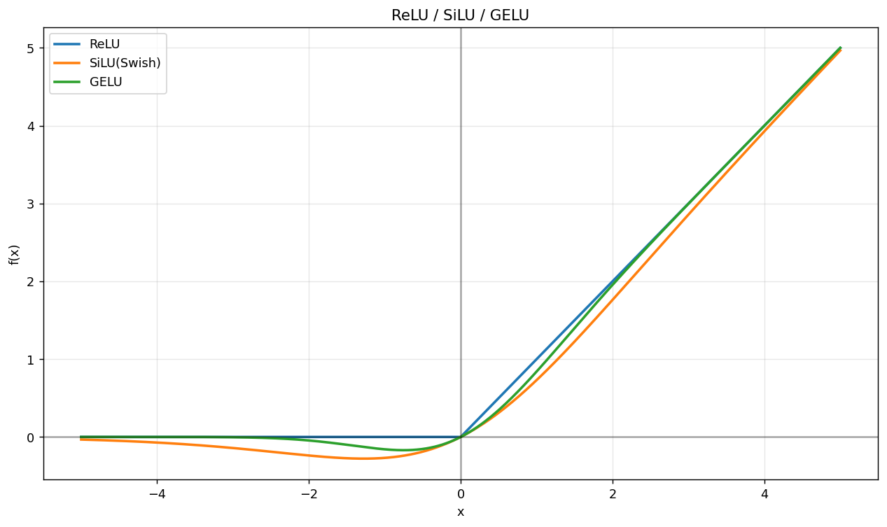

### LLM 激活值为什么是有偏的？
最近看昇腾 w8a8 量化的时候冒出来一个问题，为什么 llm 激活值是有偏的？这里的有偏无偏指平均值是否是零。有偏会导致 w8a8 量化繁琐，多出来一个 quant_bias。

哪里引入的偏置？ReLU/Swish/GELU 一堆激活函数通常都是有偏的，这些激活函数 $x>0$ 时的幅度大于 $x<0$ 。

其他计算基本不会引入偏置，大部分 LLM 的线性层都没有 bias 毕竟。

transformers 最早是有 LayerNorm 的，LayerNorm 能消除偏置。不过现在的 LLM 全是 RMSNorm 了，只能缓解偏置，消除不了。