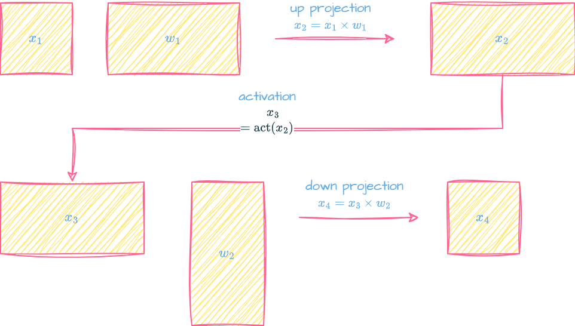
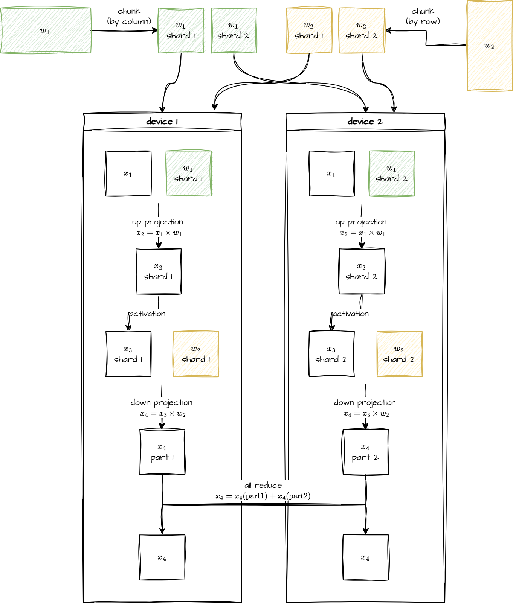

## Tensor Parallel（推理）
### 背景
现代大语言模型权重很大，动辄上百 G，没法放在一张卡上，按照矩阵乘法的特性很自然想到切分存放权重，tensor parallel（简称TP） 是基于这种想法的朴素实现。本文用一个简单的 MLP 结构举例说明推理时 TP 的实现。
### 非切分场景
一个经典的 MLP 结构（升维、激活函数、降维）：
$$y=\text{act}(x\times w_1)\times w_2$$
$x$ 是输入，乘 $w_1$ 是升维，所以在图里画的比较宽。乘 $w_2$ 是降维，所以图里画的比较瘦长。最后输出 $y$ 形状和 $x$ 一样。

### 切分场景
假设在两卡上切分，把 $w_1$ 按列切分，分别放到 device 1 和 device 2，这样升维可以自然地变成两个独立的矩阵乘法运算。再分别经过激活函数得到 $x_3$ 的两个切片，记 $x_3=[A\ B]$。
降维稍微麻烦一点，记 $w_{\text{2}} =
\begin{bmatrix}
C \\
D
\end{bmatrix}$，那么
$$x_3\times w_2=[A\ B]\times \begin{bmatrix}
C \\
D
\end{bmatrix}=A\times C+B\times D$$
device 1 持有 A，C, device 2 持有 B，D，所以两边单独做乘法，然后 all_reduce 求和就得到了之前未切分的 $x_4$


### vllm 切分代码
我们能经常在 vllm 的模型结构里看到 [ColumnParallelLinear](https://github.com/vllm-project/vllm/blob/fad09e8a1f51b31eba1f42ff5d651256c77a734d/vllm/model_executor/layers/linear.py#L407) 和 [RowParallelLinear](https://github.com/vllm-project/vllm/blob/fad09e8a1f51b31eba1f42ff5d651256c77a734d/vllm/model_executor/layers/linear.py#L1350) 层，就是用来干 TP 的。
在上面这个例子中，$w_1$ 的切分就是 ColumnParallelLinear 实现。关键代码：
```python
class ColumnParallelLinear(LinearBase):
    def weight_loader(self, param: Parameter, loaded_weight: torch.Tensor):

        # ... 省略非核心代码

        param_data = param.data
        if output_dim is not None and not is_sharded_weight:
            shard_size = param_data.shape[output_dim]
            start_idx = self.tp_rank * shard_size # 按照 tp rank 计算切片的起始 index
            loaded_weight = loaded_weight.narrow(output_dim, start_idx, shard_size) # 这里 output_dim 是几不知道，可能是 0，也可能是 1。数学上是按列切分，然而 vllm load 权重时可能转置，存在形式变成 [output, input]，所以也可能变成按第 0 维切分。

        # ... 省略非核心代码

    # forward 和线性层基本没区别，主要多了个 gather_output 选项，开了之后会收集多卡上的结果，我们这个例子里肯定是不开的。
    def forward(
        self,
        input_,
    ) -> torch.Tensor | tuple[torch.Tensor, Parameter | None]:
        bias = self.bias if not self.skip_bias_add else None

        # Matrix multiply.
        assert self.quant_method is not None
        output_parallel = self.quant_method.apply(self, input_, bias)

        if self.gather_output and self.tp_size > 1:
            # All-gather across the partitions.
            output = tensor_model_parallel_all_gather(output_parallel)
        else:
            output = output_parallel

        if not self.return_bias:
            return output
        output_bias = self.bias if self.skip_bias_add else None
        return output, output_bias
```
$w_2$ 的切分对应 RowParallelLinear。

```python
class RowParallelLinear(LinearBase):
    def weight_loader(self, param: Parameter, loaded_weight: torch.Tensor):
        # ... 省略非核心代码

        param_data = param.data
        if input_dim is not None and not is_sharded_weight:
            shard_size = param_data.shape[input_dim]
            start_idx = self.tp_rank * shard_size
            loaded_weight = loaded_weight.narrow(input_dim, start_idx, shard_size) # 和 ColumnParallelLinear 的区别在于这里按 input_dim 那一维切分。

        # ... 省略非核心代码

    def forward(
        self,
        input_,
    ) -> torch.Tensor | tuple[torch.Tensor, Parameter | None]:
        if self.input_is_parallel:
            input_parallel = input_
        else:
            # 如果输入没按卡切分好把输入切一次
            splitted_input = split_tensor_along_last_dim(
                input_, num_partitions=self.tp_size
            )
            input_parallel = splitted_input[self.tp_rank].contiguous()

        # Matrix multiply.
        assert self.quant_method is not None
        # 因为后面要求和，所以 bias 只需要在 rank0 计算。每张卡都加 bias 会导致结果的 bias 加了 tp_size 次。
        bias_ = None if (self.tp_rank > 0 or self.skip_bias_add) else self.bias
        output_parallel = self.quant_method.apply(self, input_parallel, bias_)

        if self.reduce_results and self.tp_size > 1:
            output = tensor_model_parallel_all_reduce(output_parallel)
        else:
            output = output_parallel

        if not self.return_bias:
            return output
        output_bias = self.bias if self.skip_bias_add else None
        return output, output_bias
